# 📱 SIRE Mobile APP

## Overview
Aplikasi ini merupakan platform mobile yang dirancang untuk mendukung proses aktualisasi dan registrasi elektor secara digital di Timor Leste. Dengan aplikasi ini, petugas lapangan dapat melakukan verifikasi data, mengumpulkan informasi pemilih, dan memperbarui status registrasi secara real-time, langsung dari perangkat mobile mereka.

---

## 🔐 Login
- **Fungsi**:  
  Pengguna dapat masuk ke aplikasi menggunakan email / kode elektor (10 Digit) dan password.

- **API**:  
  `POST http://stae-tl.com/api/auth/sign-in`  
  Body:
  ```json
  {
    "kodeUser": "user@example.com" / "0000000001",
    "password": "••••••••"
  }
  ```

- **Screenshot**:  
  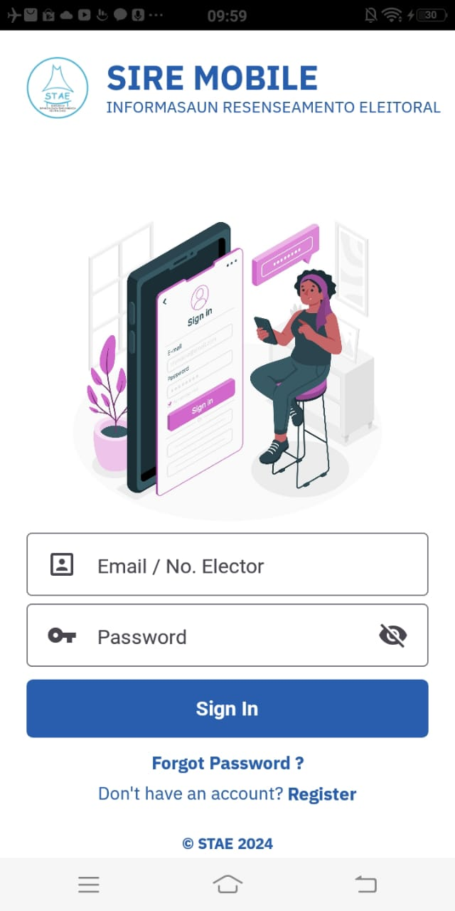

---

## 📊 Dashboard
- **Fungsi**:  
  Dashboard menyediakan ringkasan data yang komprehensif dan akses cepat ke fitur utama aplikasi. Halaman ini menampilkan berbagai informasi penting terkait status registrasi dan aktualisasi elektor melalui antarmuka yang mudah dipahami.  
  Terdapat slide interaktif yang menampilkan:
    - **Elector Overview**: Gambaran umum mengenai jumlah dan status elektor yang terdaftar.
    - **Total Registered Electors**: Total elektor yang telah berhasil terdaftar dalam sistem.
    - **Elector Actualization Summary**: Ringkasan proses aktualisasi data elektor yang telah dilakukan.
    - **Outstanding Electors**: Daftar elektor yang belum menyelesaikan proses registrasi atau aktualisasi.
    - **Newly Registered Electors**: Jumlah elektor baru yang berhasil terdaftar dalam periode terbaru.

  Di layar ini juga terdapat **Main Features** yang memberikan akses cepat ke berbagai fitur utama aplikasi, termasuk:
    - **Electors**: Daftar elektor yang terdaftar dalam sistem.
    - **Verify Elector**: Fitur untuk memverifikasi status registrasi dan aktualisasi elektor.
    - **Double Elector**: Fitur untuk mengidentifikasi duplikasi data elektor.
    - **Users**: Manajemen data pengguna aplikasi.
    - **Regions**: Pengelolaan data wilayah dan pembagian geografis.
    - **Reports**: Akses ke laporan-laporan penting terkait data elektor dan registrasi.


- **API**:  
  `POST http://stae-tl.com/api/package-info/rekap-input`  
  Body:
  ```json
  {
    "prtg01": "14/04/2025",
    "prtg02": "14/04/2025",
    "prdistrik": "13"
  }
  ```
- **Screenshot**:  
  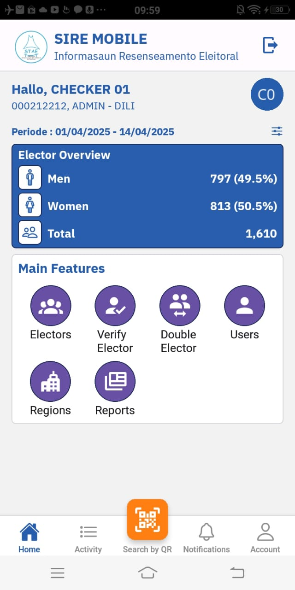
  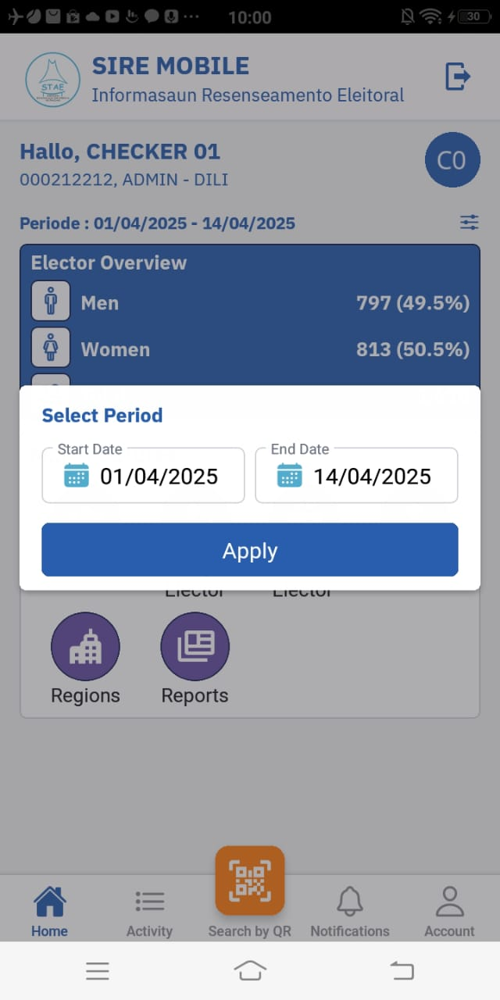

---

## 📋 Elector
- **Fungsi**:  
  Menampilkan keseluruhan data elektor yang mencakup baik elektor yang telah melakukan aktualisasi maupun elektor yang baru terdaftar.

- **API**:  
  `POST http://stae-tl.com/api/package-info/cari-elector`  
  Body:
  ```json
  {
    "prkdelektor": "ALL",
    "prnama": "",
    "prtglahir": "",
    "prnmayah": "",
    "prnmibu": "",
    "prdistrik": "ALL",
    "prsubdistrik": "",
    "prsuku": "",
    "praldeia": "",
    "prstatus": "",
    "prsts_ar": "",
    "prorder": 1,
    "p_page_number": 1,
    "p_rows_per_page": 10
  }
  ```

- **Screenshot**:  
  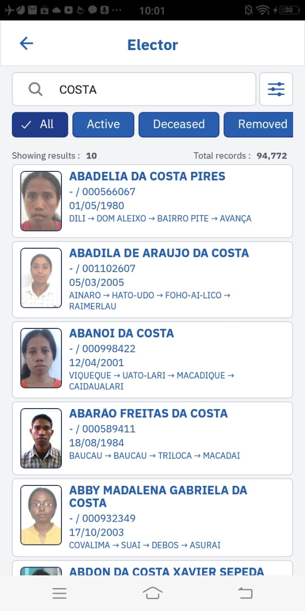
  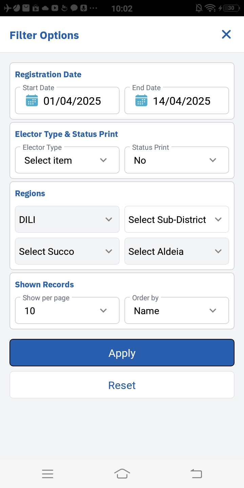
  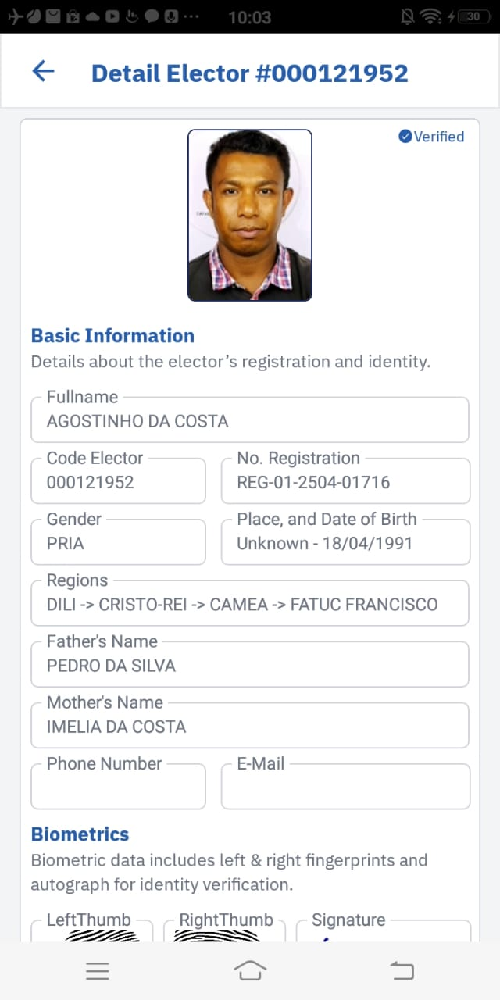

---

## ✔️ Verify Elector
- **Fungsi**:  
  Layar ini memungkinkan pengguna dapat melakukan pencarian dan pengecekan status setiap elektor, serta memastikan apakah elektor telah terdaftar dengan benar atau masih perlu melakukan langkah-langkah lebih lanjut untuk menyelesaikan proses registrasi dan aktualisasi.

- **API**:  
  `POST http://stae-tl.com/api/package-info/cari-pendaftaran`  
  Body:
  ```json
  {
    "prtg01": "14/04/2025",
    "prtg02": "14/04/2025",
    "prnopendaftaran": "ALL",
    "prurut": 1,
    "prkdelektor": "ALL",
    "prnama": "ALL",
    "prtglahir": "ALL",
    "prnmayah": "ALL",
    "prnmibu": "ALL",
    "prdistrik": "ALL",
    "prsubdistrik": "ALL",
    "prsuku": "ALL",
    "praldeia": "ALL",
    "prstatus": "ALL",
    "prsts_ar": "",
    "prsts_verif": "ALL",
    "prcetak": "TIDAK",
    "pruser_input": "ALL",
    "prorder": 1,
    "p_page_number": 1,
    "p_rows_per_page": 10,
  }
  ```

- **Screenshot**:  
  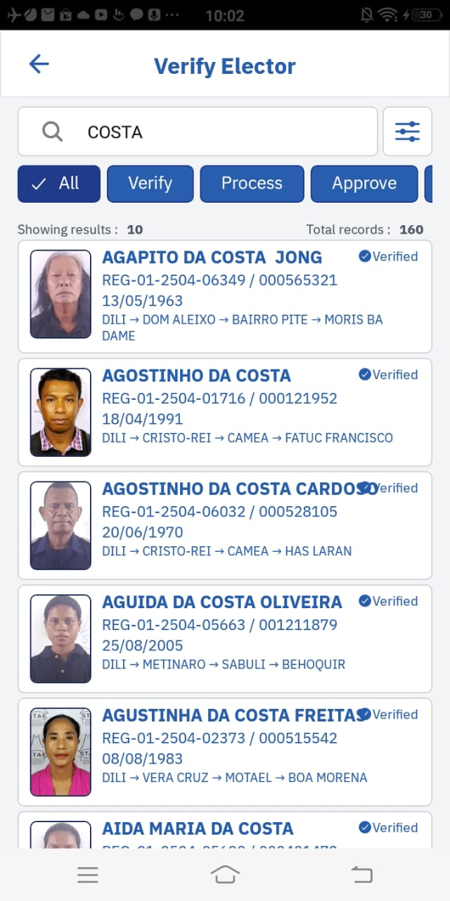
  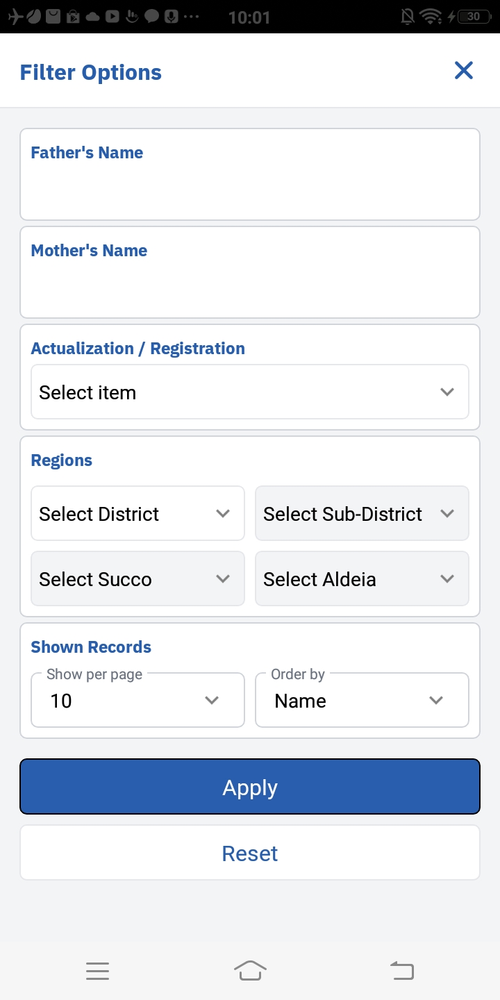
  

---

## ✔️ Double Elector
- **Fungsi**:  
    Fitur ini membantu memastikan bahwa tidak ada elektor yang terdaftar lebih dari sekali, yang dapat menyebabkan ketidaksesuaian dalam proses registrasi dan aktualisasi. Pengguna dapat mencari elektor yang memiliki data duplikat berdasarkan kriteria tertentu, seperti nama, nomor identitas, atau kode elektor, untuk memastikan integritas data dalam sistem.

- **API**:  
  `POST http://stae-tl.com/api/package-info/elektor-double`  
  Body:
  ```json
  {
    "prtg01": "14/04/2025",
    "prtg02": "14/04/2025",
    "prkdelektor": "ALL",
    "prnama": "ALL",
    "prdistrik": "ALL",
    "prsubdistrik": "ALL",
    "prsuku": "ALL",
    "praldeia": "ALL",
    "prorder": 0,
    "prsts_ar": "ALL",
    "p_page_number": 1,
    "p_rows_per_page": 10,
  }
  ```

---

## ✔️ Detail Elector
- **Fungsi**:  
  Fitur **Detail Elector** memberikan akses untuk melihat informasi lengkap mengenai setiap elektor yang terdaftar dalam sistem. Pengguna dapat memeriksa data elektor secara mendetail, termasuk informasi pribadi, status registrasi, aktualisasi, serta riwayat perubahan data.  
  Selain itu, dalam halaman **Detail Elector**, terdapat data biometrik yang terhubung dengan elektor, yaitu:
    - **Tanda Tangan (TTD)**: Setiap elektor dapat menandatangani formulir atau dokumen secara digital, dan tanda tangan ini disimpan sebagai bukti autentikasi dalam sistem.
    - **Sidik Jari (Fingerprint)**: Data sidik jari elektor digunakan untuk verifikasi identitas dan meningkatkan keamanan dalam proses registrasi serta aktualisasi.

- **API**:  
  `POST http://stae-tl.com/api/package-info/cari-elektor`  
  Body:
  ```json
  {
    "prkdelektor": "0000000001",
    "prnama": "",
    "prtglahir": "",
    "prnmayah": "",
    "prnmibu": "",
    "prdistrik": "ALL",
    "prsubdistrik": "",
    "prsuku": "",
    "praldeia": "",
    "prstatus": "",
    "prsts_ar": "",
    "prorder": 1,
    "p_page_number": 1,
    "p_rows_per_page": 10
  }
  ```

- **Screenshot**:  
  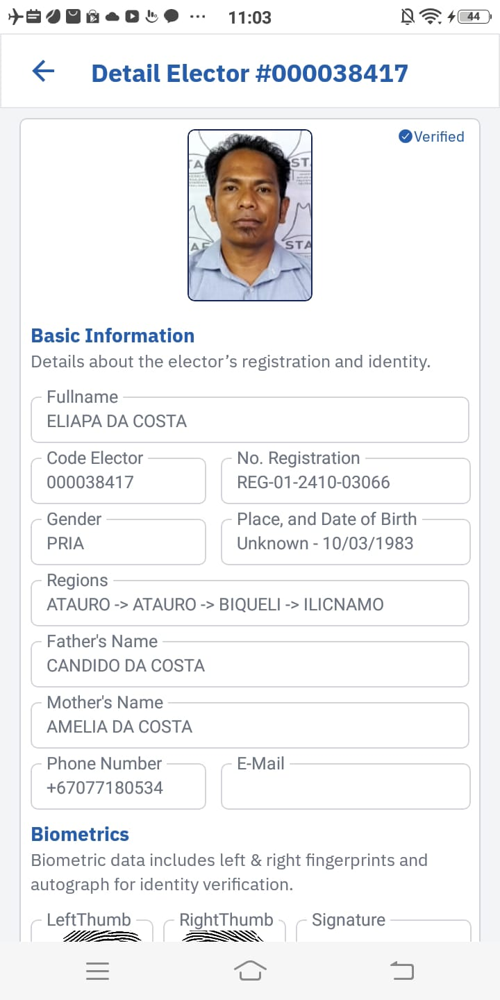
  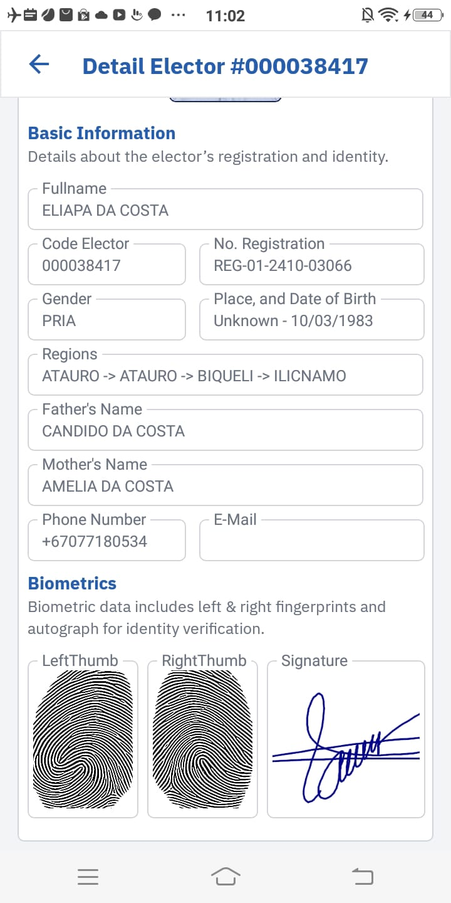

---

## ✔️ Search Elector Detail by Scan QR
- **Fungsi**:  
  Fitur **Search Elector by Scan QR** memungkinkan pengguna untuk mencari data elektor dengan cepat menggunakan pemindaian kode QR yang terhubung dengan identitas elektor. Fitur ini mempermudah proses pencarian elektor di sistem dengan hanya memindai QR code yang telah terdaftar, tanpa perlu memasukkan data manual.  
  Tombol **Scan QR** dapat ditemukan di menu utama aplikasi, memberikan akses langsung ke fitur ini. Pengguna cukup menekan tombol tersebut untuk membuka pemindai QR, yang kemudian akan mencari elektor yang relevan dalam sistem.

- **API**:  
  `POST http://stae-tl.com/api/package-info/cari-elektor`  
  Body:
  ```json
  {
    "prkdelektor": "0000000001",
    "prnama": "",
    "prtglahir": "",
    "prnmayah": "",
    "prnmibu": "",
    "prdistrik": "ALL",
    "prsubdistrik": "",
    "prsuku": "",
    "praldeia": "",
    "prstatus": "",
    "prsts_ar": "",
    "prorder": 1,
    "p_page_number": 1,
    "p_rows_per_page": 10
  }
  ```

- **Screenshot**:  
  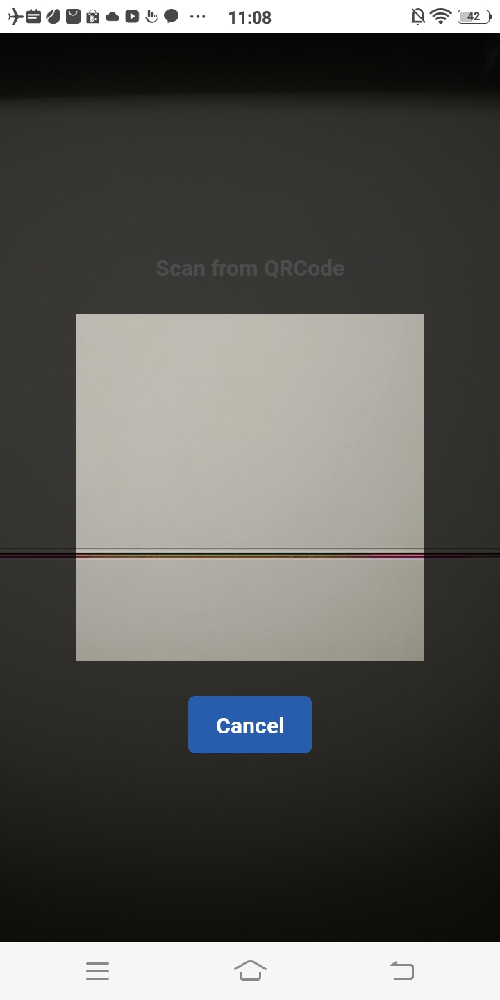
  

---

## 📦 Other Features (On Progress)

### 🔔 Notifikasi
- **Fungsi**:  
  Fitur **Notifikasi** memungkinkan aplikasi untuk mengirimkan pemberitahuan kepada pengguna mengenai pembaruan atau tindakan yang perlu dilakukan. Notifikasi ini dapat mencakup informasi penting terkait status registrasi atau aktualisasi elektor, serta pengingat atau peringatan lainnya yang relevan. Fitur ini masih dalam proses pengerjaan dan akan tersedia untuk meningkatkan interaksi pengguna dengan aplikasi.

### 📜 Log Aktivitas
- **Fungsi**:  
  Fitur **Log Aktivitas** memungkinkan pencatatan setiap tindakan atau perubahan yang dilakukan oleh pengguna dalam aplikasi. Fitur ini penting untuk memastikan transparansi dan audit trail dalam aplikasi, sehingga setiap tindakan dapat dilacak dan diperiksa bila diperlukan. Log Aktivitas sedang dalam tahap pengembangan untuk memastikan fungsionalitas yang akurat dan efisien.

### 👤 Detail Account
- **Fungsi**:  
  Fitur **Detail Account** menyediakan informasi lengkap mengenai akun pengguna, termasuk pengaturan akun, preferensi, dan status pengguna dalam aplikasi. Fitur ini juga mencakup fasilitas **ganti bahasa**, memungkinkan pengguna untuk memilih bahasa yang digunakan dalam aplikasi sesuai dengan preferensi mereka. Fasilitas ini bertujuan untuk meningkatkan kenyamanan pengguna dengan menyediakan antarmuka dalam berbagai bahasa. Fitur ini masih dalam tahap pengembangan untuk memastikan kemudahan akses dan penggunaan.


---

## 📝 Catatan Tambahan
- Versi Aplikasi: 1.0.0
- Tanggal Rilis: 30 Maret 2025
- Catatan bug atau hal-hal yang perlu diimprove

